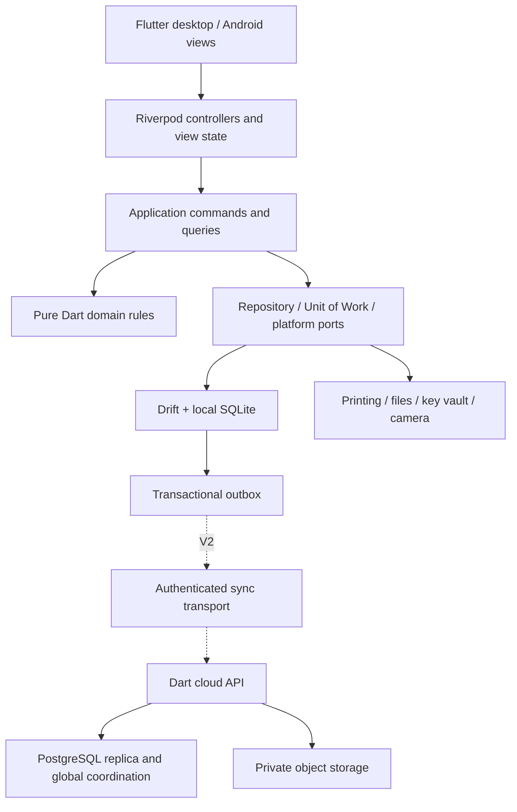

# Scalable application architecture

## Chosen structure

Use a **local-first modular monolith**: Flutter presentation, pure Dart business rules and application services, Drift repositories over local SQLite, and replaceable platform adapters. V1 is a single installation with one write coordinator. Avoid microservices and a message broker until measured needs justify them.



Arrows denote calls/dependencies, not permission to write arbitrary data. The cloud replication database is a durable accepted copy of branch facts; it does not independently post stock changes for an offline branch.

## Stack and package policy

| Concern | Decision | Rationale / verification |
|---|---|---|
| UI | Flutter + Dart; Material 3 tokens | Shared domain, platform-specific workflows |
| State and routing | Riverpod; go_router | Explicit dependency injection; guarded navigation |
| Local persistence | Drift 2.35.0 + sqlite3 3.6.0 native assets, database isolate | P01 schema v1 passed Windows encrypted restart, wrong-key, migration, rollback and consistent-snapshot integration tests |
| Business calculations | Pure Dart fixed-point value objects | Same fixtures run on clients and Dart services |
| Serialization | Explicit versioned DTOs; generation if useful | Persistence models never leak into domain |
| Localization | Flutter ARB generation + intl | English/Marathi UI; separate invoice language |
| Documents | pdf 3.13.1 + HarfBuzz shaping through pdf_text_shaper 1.1.0; OS print adapter | Windows Marathi PDF proof passed; physical printers and other platforms remain untested |
| Secrets | OS vault adapter plus independent portable recovery | Windows DPAPI-protected storage, Keychain and Android Keystore paths require adapter tests; recovery wrapping proof passed |
| Cloud (V2) | Dart HTTP service + PostgreSQL + private object storage | Relational constraints, transactional ingestion, portability |
| Cloud identity | OIDC adapter; Firebase Auth is a candidate | Desktop support must pass capability spike |
| Cloud objects | Firebase Storage / Google Cloud Storage candidate | Access only through scoped signed requests |
| Diagnostics | Structured redacted logs; optional opt-in crash sink | Offline support and privacy |
| CI | Format/analyze/tests; Windows/macOS/Android build matrix | Platform evidence must be genuine |

P00 resolved the candidate dependency set under Dart 3.13.4 and recorded exact pins/licenses in the [dependency register](implementation/dependency-register.md); production admission remains P01 and later owning phases. Current Firebase Flutter setup documents Apple/Android/web configuration rather than Windows, so the Windows app must not depend on unverified FlutterFire desktop plugins. Use OIDC authorization code + PKCE in the system browser with loopback redirect and a provider capability spike. See [platform evidence](implementation/platform-matrix.md) and [sources](10-decisions-and-risks.md).

## Repository layout

```text
business_erp/                 # Retained generated Flutter app; entrypoints, views, DI, routing
  lib/app/
  lib/features/<module>/presentation/
  lib/l10n/
packages/
  erp_domain/                # Entities, value objects, policies, ports; no Flutter/SQL
  erp_application/           # Commands, queries, authorization, transaction coordination
  erp_local_data/            # Drift tables, DAOs, repositories, migrations
  erp_platform/              # Print, vault, files, camera adapters
  erp_sync_contracts/        # V2 wire envelopes; create only when needed
services/                   # Introduced in P13/P14, not empty V1 scaffolding
  cloud_api/                # Authentication, ingest, feed, object authorization
  branch_agent/             # One branch writer exposed over authenticated LAN API
test_fixtures/              # Versioned domain, tax, migration and recovery cases
docs/
tool/                       # Checks, fixture generation, support scripts
```

P01 retained the pre-existing `business_erp/` runner instead of moving user-created platform projects into `apps/solar_erp/`. This is a path-level accommodation only; package ownership and dependency directions are unchanged. `tool/check-package-boundaries.ps1` enforces the initial domain/application/presentation rules.

Within domain/application/data packages group by bounded module: identity, organization, catalog, parties, inventory, procurement, sales, finance, reporting, documents, operations; later projects and service. Extract another package only for a real dependency boundary. Shared code contains IDs, money, quantities, dates and errors, not a miscellaneous business-logic dump.

## Module ownership and dependency rules

| Module | Owns | Collaborates through |
|---|---|---|
| Organization/identity | Entities, branches, users, permissions, fiscal periods | Session and authorization ports |
| Catalog | Product metadata, attributes, units, price/tax defaults | Read-only product snapshots |
| Parties | Customer/supplier identity, contacts, credit policy | Party snapshots and credit checks |
| Inventory | Stock movements, serial/batch ownership, reservations, valuation | Stock posting service inside shared transaction |
| Procurement | Purchase drafts, posted bills and return references | Inventory + finance posting coordinators |
| Sales | Cart, invoice, immutable line snapshots, returns | Tax engine + inventory + finance |
| Finance | Journals, accounts, payment allocation, expenses, periods | Posting templates and reconciliation queries |
| Reporting | Projections, aggregates and exports | Read models only; never business writes |
| Operations | Audit, backups, files, print jobs, outbox | Explicit side-effect ports |
| Projects/service | Quotes, jobs, materials, technician and AMC workflow | Existing inventory/finance commands |

UI cannot import DAOs. Domain cannot import Flutter, Drift, HTTP or Firebase. Application owns cross-module transactions. Repositories receive the same transaction/session context; no independently committed stock or payment writes. Tests enforce package boundaries. There is one production implementation of each financial formula.

## Command contract

`PostSale(commandId, expectedDraftVersion, actorContext, branchId, draftId)` returns the persisted document ID/number/totals or a typed error. Actor context is supplied by a verified session, never trusted from request JSON. Within one database transaction: enforce role/branch/period, detect duplicate command, reload current draft/stock/credit/config, calculate, allocate number, write invoice and allocations, append stock and journal entries, update projections, append audit and outbox, store result. Commit before PDF creation, printing or networking. Repeating the same ID and payload returns the original result; changing the payload for that ID rejects it.

Queries are paginated and return permission-filtered DTOs. Projection queries must include organization/branch and soft-deletion rules. Cost fields are omitted from Counter responses. All errors have stable codes plus localized display messages; retryability is explicit.

## Deployment evolution

1. **V1:** single desktop process, local database and encrypted attachment directory. macOS can be that installation after platform validation. Android is not a live companion yet.
2. **V1.5:** mobile UX and supported hardware verified with isolated datasets. No database copying to simulate synchronization.
3. **V2:** move the same application/domain modules behind a packaged branch agent. Desktop and Android clients maintain local read caches and drafts; post via LAN API. The branch agent owns the only writable branch DB. It continues without internet and replicates to cloud. It can run on the main Windows machine initially. Use the same command interfaces; do not rewrite business rules.
4. **V3:** projects and service add modules and projections without changing financial transaction invariants.

No application opens SQLite over SMB, a shared drive or a consumer file-sync folder. No automatic promotion of a second offline device into a writer.

## Scale targets and growth triggers

Targets are proposed benchmark acceptance criteria, not measured capacity: V1 10,000 products, 100,000 posted documents, 1 million stock/journal lines, five years of history; V2 ten branches and ten connected counters per branch. Representative baseline: four CPU cores, 8 GB RAM and SSD; record exact hardware in evidence. Local product search p95 under 200 ms; sale posting under 750 ms excluding peripherals; paged ledger first page under 500 ms. LAN posting target p95 under 1.5 s at ten simultaneous counters. Large reports/export run as cancellable background jobs.

Use composite indexes, cursor pagination, incremental aggregates and background images/thumbs first. Measure WAL size, disk use, posting lock duration, outbox age, sync lag and recovery time. If branch write contention repeatedly misses target after query optimization, retain domain interfaces and replace branch persistence with a dedicated PostgreSQL deployment. Cloud API scales horizontally because idempotency and ordering live in PostgreSQL. Add read replicas/partitioning only after query plans and retention analysis demonstrate need. Accounting history is not discarded to make a benchmark pass.
