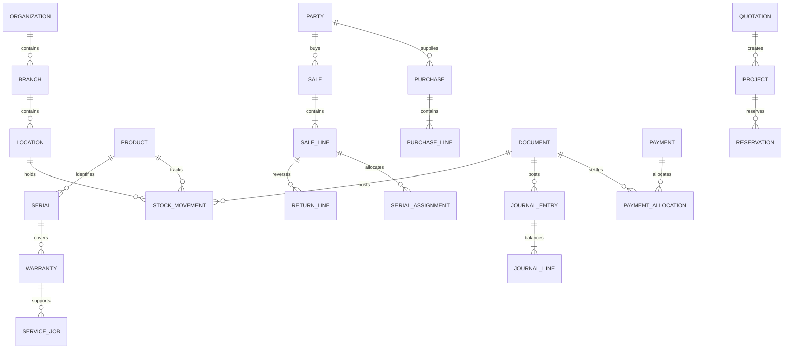

# Data model and integrity contract

This is the logical schema. Each implementing phase must add its actual migration version, columns and indexes here. Tables are introduced when their owning module is built, not all at once.

P01 introduced encrypted schema version 1 with `organizations`, `branches`, `financial_periods` and `app_metadata`. The exact columns, restrictive/composite FKs, date encodings, migration and rollback evidence are in [P01 migration notes](implementation/p01-migration-notes.md). The store checks cipher availability and applies the key before schema access; Windows integration tests passed encrypted restart, wrong-key rejection, schema-0 upgrade and transaction rollback. No financial/posting schema exists yet.

## Common types and scopes

- IDs: client-generated UUIDs; ordering comes from explicit sequence fields, never clocks or UUID sorting.
- Every business row has `organization_id`; branch-owned rows also have `branch_id`. Composite foreign keys include organization and, where relevant, branch. Tenant isolation must not depend only on UI filters.
- Master rows: `id`, `version`, UTC creation/update timestamps, actor, active flag and optional tombstone. Posted documents are immutable and referenced masters cannot be physically deleted.
- INR money: signed 64-bit integer paise for posted amounts. Unit prices/costs use fixed point with six decimal places in rupees. Quantity uses fixed point with six decimal places in base units; a unit policy restricts allowed precision. Tax rates use integer basis points. Use arbitrary-precision intermediates, checked bounds and explicit rounding before persistence.
- Business date is a date, timezone is an IANA identifier, audit timestamps are UTC instants. Never use an unzoned timestamp as a fiscal date.
- Store document snapshots of legal names, GSTIN, addresses, place of supply, SKU/name/unit/HSN, rates, policy versions and invoice language/template version. Product edits cannot rewrite history.

## Entity relationship overview

`document` is a real common header registry with `(id, organization_id, branch_id, kind, status, business_date, number, fiscal_year, source_command_id)`. Typed sale, purchase, payment and return extensions reference it. This avoids unconstrained polymorphic references from journals and movements. Quotes/service records can have their own lifecycle IDs until they create a financial document.

## Table families

| Family | Main tables and essential fields |
|---|---|
| Organization | organizations; tax_registrations(GSTIN,state); branches(registration_id,timezone); locations(branch_id,type); financial_periods(start,end,locked); settings(key,scope,version) |
| Access | users(password_hash,hash_parameters,active); roles; permissions; user_roles; role_permissions; sessions(expiry); devices(identity,authority_epoch,status); audit_events(actor,action,reason,redacted_changes,correlation_id) |
| Catalog | products(SKU,category,brand,model,base_unit,serial_policy,batch_policy,min_stock,active); categories(parent); brands; units(scale); product_units(conversion); barcodes; product_supplier_links; attribute_definitions(type,unit,category); product_attributes; price_lists; tax_rules(effective_from,to,HSN,rate,classification) |
| Attachments | attachments(hash,mime,size,storage_key,status); attachment_links(entity_id,kind); attachment_jobs; thumbnails. Sensitive customer documents require scoped access |
| Parties | parties(customer_flag,supplier_flag,name,credit_limit,payment_terms); party_addresses; party_contacts; party_tax_details. Opening balances are journals, not editable amounts |
| Inventory | stock_movements(document_id,line_id,product,location,batch,quantity_delta,value_delta,cost_snapshot,sequence); stock_balances(quantity,value,version); serials(normalized_serial,product,state,location); serial_events; batches(lot,supplier,expiry); reservations(quantity,status,expires_at); stock_adjustments(reason,approval) |
| Procurement | purchase_headers(supplier,external_invoice_no,date); purchase_lines(quantity,price,discount,tax_snapshot,landed_cost); purchase_return_headers; purchase_return_lines(original_line_id,quantity,credit_amount) |
| Sales | sale_drafts(version,cart); sale_headers(party,tax_snapshot,totals); sale_lines(snapshots,quantity,unit_price,discount,tax,cost); line_serial_assignments; sales_return_headers; sales_return_lines(original_line_id,quantity,disposition,credit_amount) |
| Finance | accounts(code,type,control_role); journal_entries(document_id,posting_date,reversal_of); journal_lines(account,debit,credit,party_id,project_id); payments(direction,method,reference,amount,status); payment_allocations(payment_id,document_id,amount); credit_allocations; expenses(category,tax,cost_center); cash_sessions(opening,expected,counted,variance) |
| Document control | documents; document_sequences(registration,year,type,series,next_value,authority_epoch); command_results(command_id,payload_hash,result); print_jobs(document_id,template_version,status,attempt); export_jobs |
| Operations | outbox(event_id,stream_seq,payload_version,payload,attempt,next_retry); inbox(event_id,hash); sync_cursors(stream,cursor); sync_conflicts; backup_runs(manifest_hash,status,destination); schema_migrations |
| V2 | branch_authorities(epoch,device); transfer_headers(source,destination,status); transfer_lines; transfer_receipts; cloud_ingest_streams; master_change_requests; cloud_backup_manifests |
| V3 projects | quotation_headers(revision,status,valid_until); quotation_lines(BOM,price,tax,service_flag); sites; projects(accepted_quote_version,status,budget); project_reservations; material_issues; delivery_records; installation_tasks; project_costs |
| V3 service | warranties(serial,sale_line,start,end,terms_snapshot); technicians; service_jobs(status,site,assigned_user); service_visits; spare_issues; AMC_contracts(start,end,coverage,price); service_schedules; reminder_jobs(dedup_key,status) |

## Required constraints and indexes

1. Unique SKU and normalized barcode per organization; unique normalized serial per organization + product, plus a warning for cross-product duplicates. Serial assignment must target the same product and branch stock as its document line.
2. Unique document number per tax registration + financial year + document type/series policy. Sequence increment is in the posting transaction. Number format is validated against the current approved invoice rules; draft IDs are not tax invoice numbers.
3. Unique command ID + organization; store a payload hash. Unique journal posting key `(document_id, posting_kind)` and movement key `(document_id,line_id,movement_kind,location_id,serial_or_batch_key)` with explicit non-null sentinel values where required. SQL nullable uniqueness must not allow duplicate postings.
4. Quantity > 0 on commercial lines; movements are signed. Serial-tracked quantities are whole units and assignment count equals quantity. Base-unit conversion factors are positive and snapshotted.
5. Journal lines have exactly one positive debit or credit. Entry-level sum(debits)=sum(credits), enforced by the posting coordinator and reconciliation; PostgreSQL ingestion adds deferred validation or equivalent transaction constraint.
6. Payment allocation totals cannot exceed available payment/credit or invoice outstanding. Return totals cannot exceed original line quantity minus prior accepted returns. Check under the write lock, not only in a form validator.
7. Stock value/quantity projections update transactionally with movements; they are rebuildable. No stock quantity on `products` is writable business truth. Available = sellable on-hand - active reservations; quarantined/transit stock is excluded.
8. Index `(organization_id,branch_id,business_date,id)` for documents; `(organization_id,product_id,location_id,sequence)` for stock; `(organization_id,party_id,posting_date,id)` for journals; `(state,next_retry_at)` for jobs; `(stream_id,sequence)` for synchronization. Add search indexes for SKU, barcode, serial and normalized name. Verify query plans.
9. FKs enabled for every SQLite connection. Posted extension rows cannot be orphaned. Draft child deletion is allowed; posted deletion/update is rejected at application and database protection layers where feasible.
10. External supplier bill duplicate check uses supplier + financial year + normalized invoice number; duplicates require explicit resolution, not silent import duplication.

## Schema migrations and imports

Export Drift schema snapshots, write step-by-step migration tests, and run upgrades from each supported release. Take a verified backup before migration; perform data transforms in a transaction where supported. Do not overwrite unknown newer schema versions or automatically downgrade. Interrupted upgrade must leave an old usable DB or a validated new DB.

Opening import supports CSV with a preview, mapping, per-row errors, deduplication and import command IDs. Opening stock is an authorized stock document with valuation and serials; opening dues are balanced journal documents. Re-importing the same batch does not post again. Reconcile imported totals with a signed opening report before trading.

P01's current manual snapshot is a consistent encrypted SQLite snapshot verified before finalization. It is device-key-bound and is not yet the portable archive/restore mechanism required before pilot data; see the [migration notes](implementation/p01-migration-notes.md).
