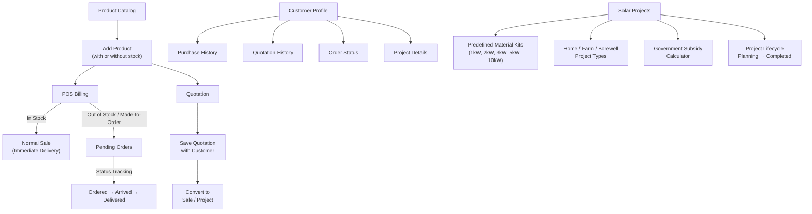
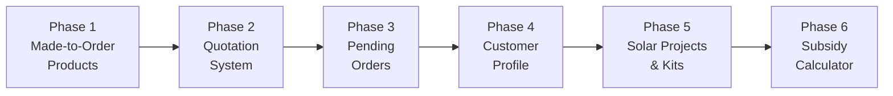

# Solar Shop ERP — Feature Enhancement Plan

> **Two bugs were already fixed** before this plan:
> 1. ✅ **Stock Location Mismatch** — POS used `'MAIN_WH'` but inventory stores stock under `'loc_default_sellable'`. Fixed by aligning location IDs.
> 2. ✅ **Party Master using mock data** — `parties_page.dart` was using hardcoded `_mockParties` instead of querying the database. Rewritten to use `runtime.database.searchParties()`.

---

## Overview of Requested Features



---

## Phase 1: Inventory — Products Without Stock (Made-to-Order)

### What Changes
- Allow adding products to catalog **without opening stock** (already partially works)
- Add a `isMadeToOrder` flag to products so billing flow knows this product doesn't need stock check
- Made-to-order products skip the stock validation in `PostSaleUseCase`

### Domain Changes (`erp_domain/src/catalog.dart`)
```dart
// Add to Product class:
final bool isMadeToOrder; // defaults to false
```

### Database Changes
- Add `is_made_to_order` boolean column to `products` table

### UI Changes
- Add "Made to Order / Order on Demand" toggle in Add Product Dialog
- Show a badge on POS for made-to-order items

---

## Phase 2: Quotation System

### What Exists Already
- Domain models: `QuotationHeader`, `QuotationLine` in `projects.dart` ✅
- No UI or database persistence yet

### What to Build

#### 2a. Database Tables
- `quotation_headers` — stores quotation metadata
- `quotation_lines` — stores line items with product, qty, price, tax

#### 2b. Quotation Page (`features/sales/quotation_page.dart`)
- Similar layout to POS but with "Save Quotation" instead of "Generate Bill"
- Customer selection (required)
- Product search & add (including made-to-order products)
- Auto-calculate GST, totals
- Set validity period
- Print/Preview quotation

#### 2c. Quotation List Page
- View all quotations with filter by status (Draft, Sent, Approved, Rejected)
- Click to view/edit
- "Convert to Sale" button → auto-populates POS with quotation items
- "Convert to Project" button → creates a Solar Project

---

## Phase 3: Pending Orders (Order Management)

### New Domain Model (`erp_domain/src/sales.dart`)
```dart
enum OrderStatus {
  pending,        // Order placed, awaiting stock
  ordered,        // Ordered from supplier
  partialArrival, // Some items arrived
  arrived,        // All items in stock
  readyToDeliver, // Packed & ready
  delivered,      // Handed to customer
  cancelled,
}

final class SaleOrder {
  final String id;
  final String organizationId;
  final String branchId;
  final String customerPartyId;
  final String customerName;
  final String customerPhone;
  final DateTime orderDate;
  final OrderStatus status;
  final String? quotationId;    // Link to quotation if converted
  final String? saleHeaderId;   // Link to sale when billed
  final Money grandTotalPaise;
  final DateTime? expectedDeliveryDate;
  final String? notes;
  final DateTime createdAtUtc;
}

final class SaleOrderLine {
  final String id;
  final String orderId;
  final String productId;
  final String productName;
  final Quantity quantity;
  final UnitPrice unitPrice;
  final TaxRate taxRate;
  final bool isInStock;     // Tracks if this line's stock has arrived
}
```

### Database Tables
- `sale_orders` — order header
- `sale_order_lines` — order line items

### UI: Orders Page (`features/sales/orders_page.dart`)
- Tab: **Pending Orders** | **Completed Orders**
- Each order card shows: Customer Name, Phone, Order Date, Items, Total, Status
- Status change dropdown: Pending → Ordered → Arrived → Ready → Delivered
- "Create Bill" button (when status = Arrived/Ready) → opens POS pre-filled

### POS Integration
- When billing a made-to-order product → auto-creates a Pending Order
- Snackbar: "Order #XYZ created for [Product]. Track in Orders section."

---

## Phase 4: Customer Profile & History

### What to Build (`features/parties/party_detail_page.dart`)

When clicking a customer in Party Master, show a detail page with tabs:

| Tab | Content |
|-----|---------|
| **Overview** | Name, GSTIN, PAN, Address, Phone, Credit Limit, Outstanding |
| **Purchase History** | List of all sale invoices with date, amount, payment status |
| **Quotations** | All quotations sent to this customer with status |
| **Pending Orders** | Active orders with delivery status |
| **Projects** | Solar projects linked to this customer |
| **Ledger** | Account balance, payment history |

### Database Queries Needed
- `getSalesByCustomer(orgId, partyId)` → List of `SaleHeader`
- `getQuotationsByCustomer(orgId, partyId)` → List of `QuotationHeader`
- `getOrdersByCustomer(orgId, partyId)` → List of `SaleOrder`
- `getProjectsByCustomer(orgId, partyId)` → List of `SolarProject`

---

## Phase 5: Solar Projects Module

### What Exists Already
- Domain models: `SolarProject`, `ProjectMaterialIssue`, `ProjectBudgetReport` ✅
- Route: `/projects` ✅
- Placeholder `projects_page.dart` ✅

### 5a. Predefined Material Kits (BOM — Bill of Materials)

#### New Domain Model
```dart
final class SolarKit {
  final String id;
  final String name;           // "1 kW Rooftop Home"
  final String category;       // "residential_rooftop" | "farm_borewell" | "farm_drip" | "commercial"
  final double capacityKw;
  final List<SolarKitLine> materials;
  final Money estimatedInstallationCost;
  final Money estimatedTotalCost;
}

final class SolarKitLine {
  final String productId;
  final String productName;
  final Quantity quantity;
  final String unit;
  final UnitPrice estimatedUnitPrice;
}
```

#### Predefined Kits (Admin configurable)

| Kit | Capacity | Type | Typical Materials |
|-----|----------|------|-------------------|
| Home Rooftop 1 kW | 1 kW | Residential | 3× 335W Panels, 1× 1kW Inverter, Mounting Structure, Cable, MC4 Connectors, Earthing Kit, ACDB/DCDB |
| Home Rooftop 2 kW | 2 kW | Residential | 6× 335W Panels, 1× 2kW Inverter, Mounting Structure, Cable, MC4, Earthing, ACDB/DCDB |
| Home Rooftop 3 kW | 3 kW | Residential | 8× 395W Panels, 1× 3kW Inverter, ... |
| Home Rooftop 5 kW | 5 kW | Residential | 12× 440W Panels, 1× 5kW Inverter, ... |
| Home Rooftop 10 kW | 10 kW | Residential | 23× 440W Panels, 1× 10kW Inverter, ... |
| Farm Borewell 3 HP | 2.2 kW | Agriculture | Solar Pump Controller, 3 HP Submersible Pump, 8× 335W Panels, Cable, Structure |
| Farm Borewell 5 HP | 3.7 kW | Agriculture | Solar Pump Controller, 5 HP Submersible Pump, 12× 335W Panels, ... |
| Farm Borewell 7.5 HP | 5.5 kW | Agriculture | Solar Pump Controller, 7.5 HP Pump, 16× 440W Panels, ... |
| Farm Borewell 10 HP | 7.5 kW | Agriculture | Solar Pump Controller, 10 HP Pump, 22× 440W Panels, ... |

### 5b. Solar Projects Page UI

#### Projects List View
- Filter: All | Planning | In Progress | Completed
- Each project card: Customer, Site, Capacity, Status, Budget vs Actual

#### Create Project Flow
1. Select Customer (or create new)
2. Choose Kit Template (1kW, 2kW, etc.) or start blank
3. Kit auto-populates materials → can modify quantities/products
4. Add installation charges, labor
5. Calculate subsidy (see Phase 6)
6. Generate Quotation → on approval → Start Project

#### Project Detail View
- **Overview**: Customer, Site, Capacity, Status, Timeline
- **Materials BOM**: List from kit + modifications, with stock status
- **Material Issue**: Track which materials have been issued from inventory
- **Expenses**: Labor, transport, permits
- **Subsidy**: Government subsidy details & calculation
- **Documents**: Quotation, Invoices, Completion Certificate
- **Status Flow**: Planning → In Progress → Completed

---

## Phase 6: Government Subsidy Calculator (Maharashtra)

### PM Surya Ghar Muft Bijli Yojana (Residential Rooftop)

Central Government subsidy for residential rooftop solar (as of 2024-25):

| System Capacity | Subsidy per kW | Total Subsidy |
|-----------------|----------------|---------------|
| Up to 2 kW | ₹30,000/kW | Up to ₹60,000 |
| 2 kW to 3 kW | ₹30,000/kW for first 2kW + ₹18,000/kW beyond | Up to ₹78,000 |
| Above 3 kW (up to 10 kW) | Same slab as above | Max ₹78,000 |

> [!NOTE]
> Maharashtra does NOT provide additional state subsidy on top of the central subsidy for residential rooftop solar as of 2024-25.

### PM-KUSUM Scheme (Agricultural Solar Pumps)

| Component | Subsidy |
|-----------|---------|
| Component-A (Standalone Solar Power Plants) | 25% Central + State varies |
| Component-B (Standalone Solar Pumps) | **60% subsidy** (30% Central + 30% State) for small/marginal farmers; **50%** for others |
| Component-C (Grid-connected Solar on Existing Pumps) | 30% Central + 30% State |

> For Maharashtra specifically:
> - MEDA (Maharashtra Energy Development Agency) administers the state portion
> - Farmer pays only **10-20%** of total cost (remaining from bank loan if needed)
> - Capacity: 3 HP to 10 HP solar pump systems

### Subsidy Calculator Domain Model
```dart
final class SubsidyScheme {
  final String id;
  final String name;           // "PM Surya Ghar" | "PM-KUSUM-B"
  final String category;       // "residential" | "agriculture" | "commercial"
  final String state;          // "Maharashtra"
  final List<SubsidySlab> slabs;
  final bool isActive;
  final DateTime effectiveFrom;
  final DateTime? effectiveUntil;
}

final class SubsidySlab {
  final double fromKw;
  final double toKw;
  final int subsidyPerKwPaise;  // e.g., 3000000 for ₹30,000/kW
  final double percentageOfCost; // Alternative: 60% of total cost
  final bool isPercentageBased;
}
```

### UI: Subsidy Tab in Project
- Auto-select scheme based on project type (Residential / Agricultural)
- Show slab-wise calculation
- Admin can override subsidy amount
- Show: Total Project Cost → Subsidy Amount → Customer Payable Amount
- Generate customer-facing quotation showing subsidy benefit

### Admin Settings (`features/settings/`)
- Manage subsidy schemes
- Edit slab rates
- Enable/disable schemes
- Add custom state-specific schemes

---

## Implementation Priority & Sequence



| Phase | Effort | Files Changed |
|-------|--------|---------------|
| Phase 1 | Small | `catalog.dart`, `add_product_dialog.dart`, `sales_use_cases.dart` |
| Phase 2 | Medium | New `quotation_page.dart`, DB tables, store methods |
| Phase 3 | Medium | New `orders_page.dart`, domain models, DB tables, POS integration |
| Phase 4 | Medium | New `party_detail_page.dart`, DB queries |
| Phase 5 | Large | Full `projects_page.dart` rewrite, kits UI, material issue |
| Phase 6 | Medium | New `subsidy.dart` domain, calculator, settings UI |

---

> [!IMPORTANT]
> This is a large feature set spanning **6 phases across all 4 packages** (domain, application, local_data, business_erp). I recommend using the **`/plan`** command to execute each phase step-by-step, or **`/boost`** for deep implementation of individual phases.

Would you like me to start implementing **Phase 1** (Made-to-Order products + skip stock check) right away?
