# Money, Tax & Chart of Accounts Calculation Fixtures & Policies

This document serves as the authoritative technical reference and versioned calculation fixture specification for prompt **P04 — Money, Tax, and Chart of Accounts** in the Shree Krushna Sales ERP architecture.

---

## 1. Deterministic Money & Fixed-Point Precision Rules

To guarantee absolute financial integrity across Windows, macOS, and Linux without floating-point inaccuracies (`0.1 + 0.2 != 0.3`), all monetary calculations use strict 64-bit integer representations.

### Fixed-Point Scale Specifications

| Domain Type | Base Representation | Internal Scale | Resolution | Example |
| :--- | :--- | :--- | :--- | :--- |
| **`Money`** | 64-bit Signed Integer | Paise (1/100 INR) | ₹0.01 | `1180000` = ₹11,800.00 |
| **`UnitPrice`** | 64-bit Signed Integer | Micro-Rupees (1/1,000,000 INR) | ₹0.000001 | `12500000` = ₹12.500000 |
| **`Quantity`** | 64-bit Signed Integer | Micro-Units (1/1,000,000 Units) | 0.000001 | `10500000` = 10.500000 Units |
| **`TaxRate`** | Integer Basis Points | Basis Points (1 bps = 0.01%) | 0.01% | `1800` = 18.00% GST |

---

## 2. Indian GST Tax Engine Specification

### 2.1 Supply Type Rules
- **Intra-State (`TaxSupplyType.intraState`)**: Applied when Vendor State Code == Customer State Code. Split equally into **CGST** (Central GST) and **SGST** (State GST).
  - CGST Rate = `TaxRate / 2`
  - SGST Rate = `TaxRate / 2`
  - IGST Rate = `0`
- **Inter-State (`TaxSupplyType.interState`)**: Applied when Vendor State Code != Customer State Code.
  - CGST Rate = `0`
  - SGST Rate = `0`
  - IGST Rate = `TaxRate`

### 2.2 Tax Exclusive vs Tax Inclusive Line Calculations

#### Tax Exclusive (`pricesIncludeTax = false`)
$$\text{Line Gross Taxable Paise} = \left\lfloor \frac{\text{UnitPrice (micro)} \times \text{Quantity (micro)}}{10^{10}} \right\rceil$$

#### Tax Inclusive (`pricesIncludeTax = true`)
$$\text{Line Taxable Paise} = \left\lfloor \frac{\text{Line Gross Amount (paise)} \times 10000}{10000 + \text{TaxRateBps}} \right\rceil$$

---

## 3. Invoice Discount Allocation: Largest Remainder Algorithm

When an overall invoice discount (e.g. ₹500.00) is applied across multiple line items, proportional distribution may yield fractional paise remainders. To eliminate unaccounted rounding drift, we use the **Largest Remainder Method**:

1. Calculate proportional floor share for each line item $i$:
   $$\text{Exact Share}_i = \frac{\text{LineTaxable}_i}{\sum \text{LineTaxable}} \times \text{InvoiceDiscountPaise}$$
   $$\text{Floor Share}_i = \lfloor \text{Exact Share}_i \rfloor$$
2. Compute remaining unallocated paise:
   $$\text{Remainder Paise} = \text{InvoiceDiscountPaise} - \sum \text{Floor Share}_i$$
3. Sort lines by fractional remainder $(\text{Exact Share}_i - \text{Floor Share}_i)$ in descending order. Break ties deterministically using string comparison on `lineId`.
4. Distribute 1 paise to the top `Remainder Paise` lines.

---

## 4. Standard Chart of Accounts (COA) Hierarchy

The system initializes default double-entry accounts with immutable control roles:

```mermaid
graph TD
    A[Chart of Accounts] --> Asset[1000 Assets]
    A --> Liability[2000 Liabilities]
    A --> Equity[3000 Equity]
    A --> Revenue[4000 Revenue]
    A --> Expense[5000 Expenses]

    Asset --> 1010["1010 Cash in Hand (Cash Control)"]
    Asset --> 1020["1020 Bank Account (Bank Control)"]
    Asset --> 1100["1100 Accounts Receivable (Customer Control)"]
    Asset --> 1200["1200 Merchandise Inventory"]
    Asset --> 1310["1310 CGST Input Tax Credit (Tax Control)"]
    Asset --> 1320["1320 SGST Input Tax Credit (Tax Control)"]
    Asset --> 1330["1330 IGST Input Tax Credit (Tax Control)"]

    Liability --> 2100["2100 Accounts Payable (Supplier Control)"]
    Liability --> 2210["2210 CGST Output Payable (Tax Control)"]
    Liability --> 2220["2220 SGST Output Payable (Tax Control)"]
    Liability --> 2230["2230 IGST Output Payable (Tax Control)"]

    Equity --> 3010["3010 Opening Balance Equity"]

    Revenue --> 4010["4010 Sales Revenue (Sales Control)"]

    Expense --> 5010["5010 Cost of Goods Sold (COGS Control)"]
    Expense --> 5090["5090 Invoice Round-off Expense (Round-off Control)"]
```



---

## 5. Double-Entry Journal Invariants

Every financial transaction posted into the ledger must satisfy:

1. **Balance Invariant**:
   $$\sum_{i} \text{DebitPaise}_i = \sum_{i} \text{CreditPaise}_i > 0$$
2. **Line Structure**: Minimum of 2 lines per journal entry.
3. **Line Mutex**: A single `JournalLine` must have either `debitPaise > 0` OR `creditPaise > 0`, NEVER both.

---

## 6. Document Numbering Sequence Rule

Compact registration sequences follow the canonical format: `{Series}/{FiscalYear2Digit}/{Padded6DigitSequence}`

### Example Sequence Allocation
- **Fiscal Year**: `2026-2027` (Year Suffix = `2627`)
- **Series**: `SKS`
- **Sequence 1**: `SKS/2627/000001`
- **Sequence 2**: `SKS/2627/000002`

---

## 7. Execution Fixtures (Verified Unit Test Results)

```yaml
Fixture 1: Intra-State 18% Exclusive Sale
  UnitPrice: ₹1,000.00
  Quantity: 10.00
  Subtotal: ₹10,000.00
  CGST (9%): ₹900.00
  SGST (9%): ₹900.00
  Total Tax: ₹1,800.00
  Grand Total: ₹11,800.00
  Journal Entry:
    - Dr 1100 Accounts Receivable (Party: Cust1): ₹11,800.00
    - Cr 4010 Sales Revenue: ₹10,000.00
    - Cr 2210 CGST Output Payable: ₹900.00
    - Cr 2220 SGST Output Payable: ₹900.00
  Status: VERIFIED & PASSED
```
